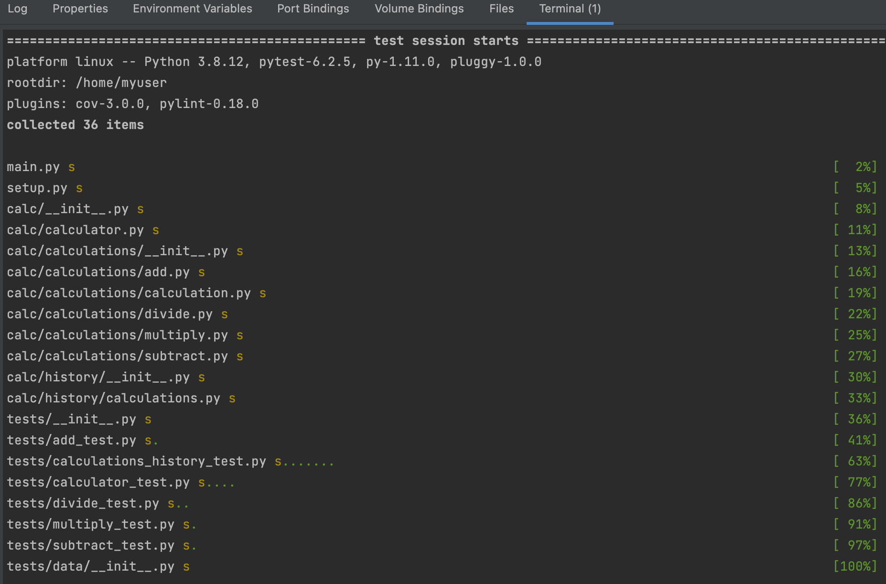
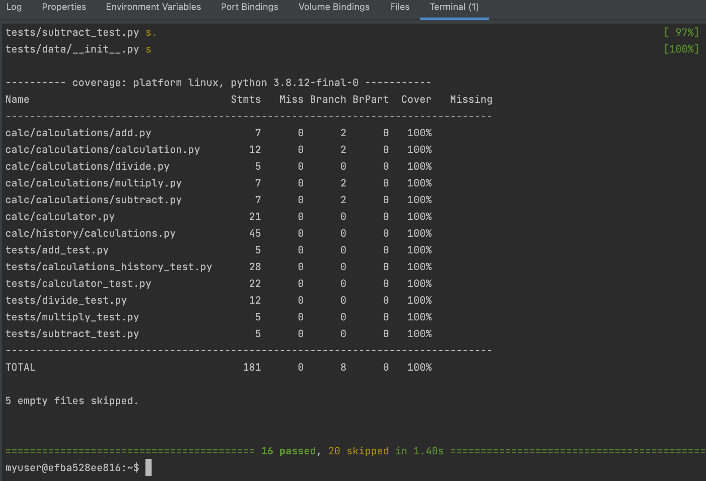
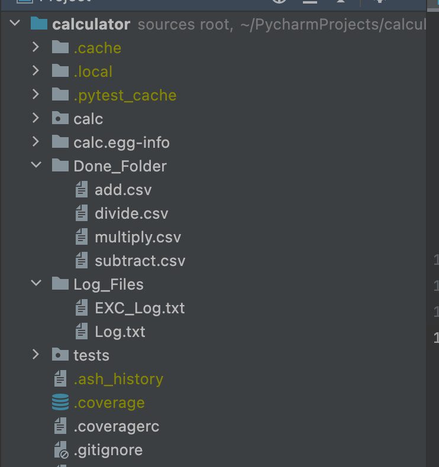
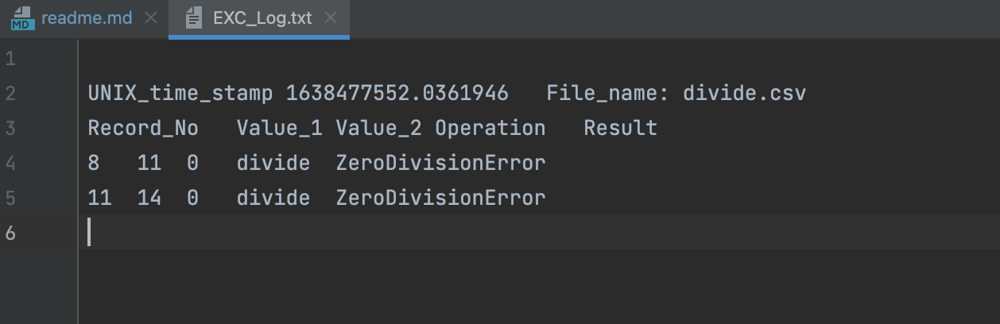
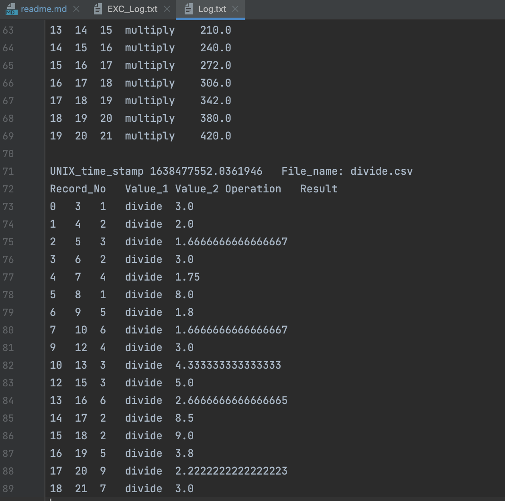

# My Calculator Program
### Main branch 
### Calc_part_2 branch 
### Calc_part_3 branch 
### Calc_part_4 branch
#### This part of the calculator read the csv and after checking all the files, it moves to Done_folder
#### It also generated two log filesin Log_Files one for the excepttion of division and secong forr tthe inputs from the csv file
#### The below scrreens shots are pylint, coverage report, Done_Folder and Log_Files with exceptional and regular log files

